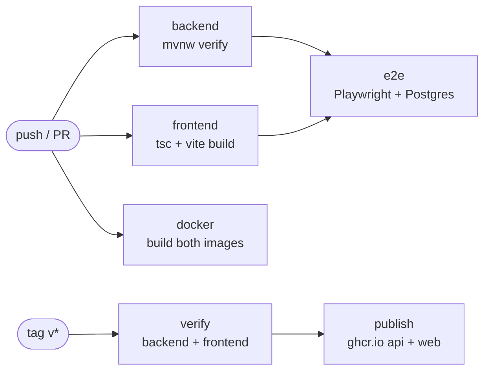

# CI/CD

GitHub Actions. Two workflows: `ci.yml` validates every change, `release.yml` publishes
container images.

---

## Pipeline



---

## `ci.yml`

Runs on push to `main`, `develop` and `feature/**`, and on pull requests into `main` or
`develop`. A new push to the same ref cancels the run in flight.

| Job | Does | Needs a database |
|--|--|--|
| `backend` | `./mvnw clean verify` — 32 unit and slice tests; uploads the jar, and the surefire reports on failure | No |
| `frontend` | `npm ci` then `npm run build`, which runs `tsc --noEmit` first, so it is the type check too | No |
| `e2e` | Boots the packaged API and the Vite dev server, then runs 22 Playwright tests | Yes — a `postgres:17-alpine` service |
| `docker` | Builds both images to prove the Dockerfiles work; does not push | No |

### Why the backend job needs no database

Every backend test is a unit test or a `@WebMvcTest` slice. The repository layer is not covered
by an integration test — see [TESTING](TESTING.md#5-not-covered). Add a Postgres service to that
job on the day a `@DataJpaTest` arrives.

### How the e2e job starts the stack

The API is packaged and run from the jar rather than through `spring-boot:run`, so devtools does
not restart it mid-suite. `JWT_SECRET` is generated once for the run — without it the signing key
is random per process and any restart would invalidate tokens. Both servers are polled until
healthy; if either fails to start, its log is printed and uploaded.

The screenshot spec is excluded with `--grep-invert "documentation screenshots"`. It writes into
`docs/`, which is a documentation task, not an assertion.

---

## `release.yml`

Runs on a `v*` tag, or manually through **workflow_dispatch** with an optional tag name.

1. **verify** — runs the backend and frontend builds again. Nothing is published unless they pass.
2. **publish** — builds and pushes two images to GHCR, in parallel:

| Image | Built from | Contents |
|--|--|--|
| `ghcr.io/<owner>/spring-boot-todolist-api` | `./Dockerfile` | JRE 21 Alpine, the Spring Boot jar, Actuator healthcheck |
| `ghcr.io/<owner>/spring-boot-todolist-web` | `./frontend/Dockerfile` | nginx serving the built SPA |

Tags come from `docker/metadata-action`: the full semver, `major.minor`, and the long commit SHA.

Authentication uses the automatic `GITHUB_TOKEN` with `packages: write`. No secret to configure.

---

## Deploying

```bash
cp .env.example .env     # fill in DB_PASSWORD and JWT_SECRET
make deploy
```

| Service | Port | Notes |
|--|--|--|
| `web` | 9001 | nginx serving the SPA |
| `app` | 9002 | the REST API |
| `db` | 9432 | PostgreSQL 17 |

### Two variables compose refuses to start without

| Variable | Why it is mandatory |
|--|--|
| `DB_PASSWORD` | No default is safe to ship |
| `JWT_SECRET` | Unset means a random key per process: every restart invalidates issued tokens, and two replicas would reject each other's. Generate with `openssl rand -base64 48` |

### The SPA's API URL is baked in at build time

Vite inlines `VITE_API_BASE_URL` into the bundle, so it cannot be changed by setting an
environment variable on the running container. It must be the URL **the browser** uses, not the
one the compose network uses — `http://localhost:9002/api/v1` by default, overridden with
`API_BASE_URL` in `.env`, which compose passes as a build argument.

Rebuild the `web` image when that URL changes:

```bash
API_BASE_URL=https://api.example.com/api/v1 docker compose build web
```

If this becomes awkward, the alternative is to serve the SPA and the API from one origin behind a
reverse proxy and use a relative base URL, which also removes the need for CORS.

---

## Dependabot

`.github/dependabot.yml` opens update PRs for Maven and npm weekly, and for GitHub Actions and
base images monthly, labelled by area.

---

## Branch protection

`.husky/pre-push` refuses a direct push to `develop` or `release`; work goes through a branch and
a pull request. CI runs on `feature/**` pushes too, so a branch is validated before the PR opens.

Worth configuring on the repository itself, which the hook cannot enforce for other clients:
require the `backend`, `frontend` and `e2e` checks to pass before merging into `develop`.

---

## Not covered

| Gap | Notes |
|--|--|
| Deployment to a server | `release.yml` publishes images; nothing pulls them. There is no target environment to deploy to yet |
| Repository-layer integration tests | Would need Testcontainers and a Postgres service in the `backend` job |
| Image signing and SBOM | No cosign or syft step |
| Vulnerability scanning | No Trivy or `npm audit` gate |
| Staged rollout, smoke tests after deploy | Nothing beyond the container healthchecks |
