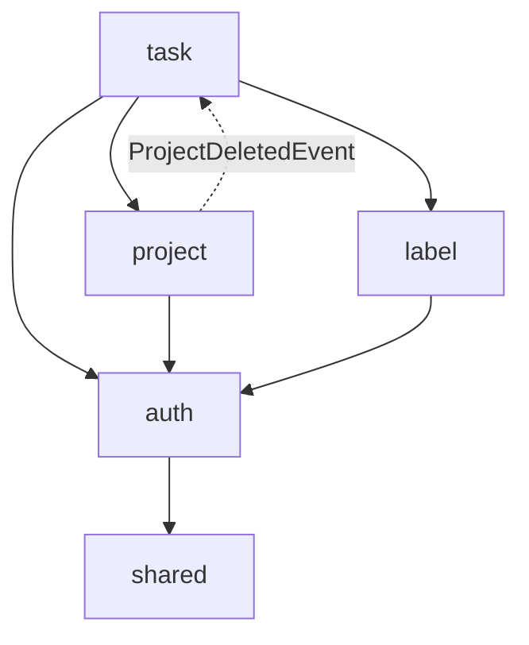
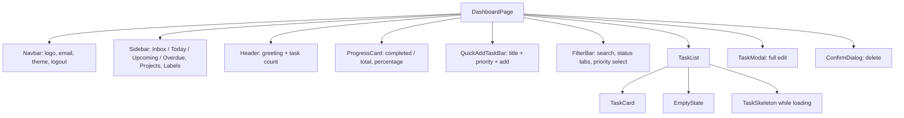

# DESIGN — Architecture and UI

What the system is made of, why it is shaped this way, and what the interface looks like.

---

## 1. References

| Source | Taken from it |
|--|--|
| [The conceptual design of Todoist](https://tuanmon.com/the-conceptual-design-of-todoist/) | Task / Project / Label model; Inbox and Today as *views* rather than entities; label as reusable many-to-many metadata |
| [To-do List Design — keyur Dasani](https://www.figma.com/community/file/1352825756540721031/to-do-list-design) | Dark violet visual language; greeting header; daily progress card; Today / Tomorrow grouping; week strip; start/end time; per-task alert toggle; priority as segmented pills |
| [To-do List Design — Amena Najeeb](https://www.figma.com/community/file/1352825756540721031/to-do-list-design) | Eisenhower matrix (urgent × important) |
| `Tasks.xlsx` house template | Module layout, exception contract, code style, security checklist, Docker and Makefile |

### Deliberately not built

Pomodoro timer, saved Filters (a stored query language), long-term Goals, and delivery of
reminders. `alert_enabled` is stored but nothing sends a notification — the flag is the contract,
the scheduler is not written.

---

## 2. Architecture

A modular monolith behind a REST API, with the UI as a separate single-page app.

```
com.todolist
├── modules/           business domains, one vertical slice each
│   ├── auth/          accounts, JWT issuance, current-user resolution
│   ├── project/       areas of life that group tasks
│   ├── label/         reusable metadata
│   └── task/          the to-do items themselves
└── shared/            cross-cutting only
    ├── config/        security, cache, JPA auditing, clock
    ├── domain/        AuditableEntity
    ├── exception/     AppException, AppErrorCode, Preconditions, fallback advice
    ├── log/           security event logging
    ├── security/      JwtTokenProvider, JwtAuthenticationFilter
    └── web/           ApiErrors, ApiErrorResponse, ApiExceptionHandler, PagedResponse
```

Each module is `domain / dto / repository / service / controller`.

### Module dependency rule

Modules depend **downward on `shared`, never sideways on each other** — with one necessary
exception: `task` reads `project` and `label`, because a task genuinely references both. The
reverse direction is forbidden, so project deletion uses a domain event
(`ProjectDeletedEvent`) that the task module listens for. Without it, `project` would have to
import `task` and the graph would cycle.



### Layer rules

| Layer | May | May not |
|--|--|--|
| Controller | map HTTP, bind and validate, choose a status | hold business logic, inject a repository, catch exceptions |
| Service | hold business logic, own the transaction | be called with an owner id from the request |
| Repository | query, always scoped by owner | return entities to a controller |
| Entity | enforce its own invariants through domain methods | expose public setters |
| DTO | carry data, map itself from an entity | hold domain behaviour, be persisted |

Services default to `@Transactional(readOnly = true)`; write methods override it.

---

## 3. API design

Base path `/api/v1`. Bearer token on everything except `/auth/register` and `/auth/login`.

| Method | Path | Purpose |
|--|--|--|
| `POST` | `/auth/register` | Create an account, return a token |
| `POST` | `/auth/login` | Exchange credentials for a token |
| `GET` | `/auth/me` | Restore a session from a stored token |
| `GET` | `/tasks` | List, filtered and paged |
| `GET` | `/tasks/progress` | Daily completion counts |
| `GET` `POST` `PUT` `DELETE` | `/tasks`, `/tasks/{id}` | CRUD |
| `PATCH` | `/tasks/{id}/status` | Checkbox toggle, one field |
| `GET` `POST` `PUT` `DELETE` | `/projects`, `/projects/{id}` | CRUD |
| `PATCH` | `/projects/{id}/archived` | Archive / restore |
| `GET` `POST` `PUT` `DELETE` | `/labels`, `/labels/{id}` | CRUD |

`GET /tasks` accepts `view`, `status`, `priority`, `projectId`, `labelId`, `urgent`, `important`,
`from`, `to`, `search`, `sortBy`, `direction`, `page`, `size`.

**Conventions.** Lists return a `PagedResponse` envelope, never a serialised `PageImpl`. `POST`
returns `201` with `Location`. `DELETE` returns `204`. `sortBy` is validated against an
allowlist, so an arbitrary value is a 400 rather than a sort on an internal column. Every failure
is an `ApiErrorResponse` — see [FLOW](FLOW.md#7-error-flow).

---

## 4. Security model

| Concern | Decision |
|--|--|
| Authentication | Stateless JWT, HS384, subject = username, 24h |
| Signing key | `JWT_SECRET` from the environment; random per process when unset, with a warning |
| Passwords | BCrypt strength 12 |
| Brute force | 5 failures per identifier, 15 minute lockout |
| CSRF | Off on `/api/**` only, which is bearer-authenticated with no ambient cookie; no other chain relaxes it |
| Isolation | Owner from `SecurityContext`, never from the request; every finder scoped by `user_id`; foreign rows are 404 |
| Input | Allowlist `@Pattern` over Unicode categories — accepts Japanese, rejects `<`, `>` and control characters |
| Output | No stack traces, no messages from exceptions, Actuator limited to `health` |
| Logging | Authentication and authorisation outcomes logged by identifier only, never PII or credentials |
| Headers | `X-Frame-Options: DENY`, CSP with `frame-ancestors 'none'`, `Referrer-Policy: same-origin` |

**Known trade-off.** The SPA stores the JWT in `localStorage`, as specified. Any XSS on the
origin can read it. The mitigations are output escaping and the input allowlist; an httpOnly
refresh cookie would remove the exposure and is the recommended hardening step.

---

## 5. UI

### Visual language

Taken from the Figma reference.

| Token | Value | Use |
|--|--|--|
| Background | `slate-950` | App canvas |
| Surface | `slate-900` | Cards, inputs, modals |
| Border | `slate-800` | Hairlines |
| Accent | `violet-500` → `fuchsia-500` | Primary buttons (gradient), active state, progress fill |
| Text | `slate-100` / `slate-400` | Primary / secondary |
| Priority HIGH | `rose` | Badge |
| Priority MEDIUM | `amber` | Badge |
| Priority LOW | `emerald` | Badge |
| Overdue | `rose-400` | Due-date emphasis |

Radius `12–16px`, generous padding, one accent only. Dark is the default; a toggle switches to
light, persisted per viewer in `localStorage`.

### Screens

| Route | Guard | Contents |
|--|--|--|
| `/login` | public | Credentials, link to register |
| `/register` | public | Username, email, password |
| `/` | protected | Dashboard |

### Dashboard composition



A `TaskCard` carries a coloured left bar, a circular checkbox that toggles
`PENDING ↔ COMPLETED`, the title, the priority badge, labels, the time box, and the due date in
rose when overdue. Edit opens the modal; delete asks first.

### Client behaviour

- **Optimistic updates** on status toggle and delete, rolled back and surfaced as a toast if the
  call fails.
- **Debounced search** at 300 ms.
- **Skeletons** on first load only; later refreshes keep the list on screen.
- **401 handling** in one axios interceptor: clear the token and redirect to `/login`, except on
  the `/auth` endpoints where a 401 is simply wrong credentials and belongs on the form.

---

## 6. Decisions worth revisiting

| Decision | Why | When to change it |
|--|--|--|
| Soft delete everywhere | Cheap audit, nothing lost | Add a purge job once `deleted` rows grow |
| Inbox as `project_id IS NULL` | Cannot be deleted or renamed; no per-user seed row | Never, unless the Inbox needs settings |
| Eisenhower as two booleans | Quadrant stays derived, cannot drift | If quadrants need their own metadata |
| Views as predicates | No stored state to migrate | When users want *saved* filters — that is a new entity |
| JWT in `localStorage` | Specified; simplest cross-origin SPA | Before production, if XSS risk is unacceptable |
| In-process login attempt counter | No extra infrastructure | As soon as there is more than one instance |
| Token survives a restart only with `JWT_SECRET` | No secret is committed | Already solved in deployment by setting the variable |
