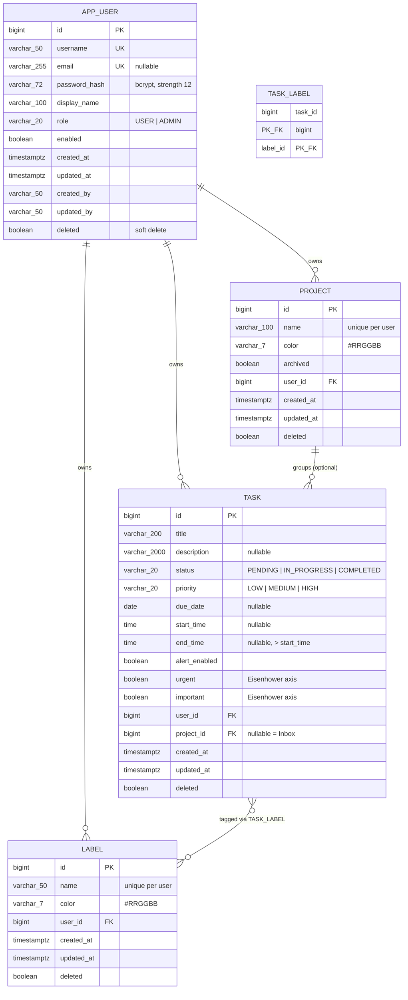

# ER — Entity Relationship

Data model for the To-Do application. PostgreSQL in every deployed environment; the `h2` dev
profile builds the same shape through `ddl-auto`.

Schema is owned by Flyway in `src/main/resources/db/migration`:

| Version | Adds |
|--|--|
| `V1__init_schema` | `app_user` |
| `V2__add_user_email_and_task` | `app_user.email`, `task` |
| `V3__add_project_label_and_eisenhower` | `project`, `label`, `task_label`, task's project / Eisenhower / time-box columns |

---

## Diagram

---

## Cardinality and rules

| Relationship | Cardinality | Rule |
|--|--|--|
| `app_user` → `task` | 1 : N | Mandatory. Every query is scoped by it; this is the isolation boundary. |
| `app_user` → `project` | 1 : N | Mandatory. Project names are unique per user, case-insensitively. |
| `app_user` → `label` | 1 : N | Mandatory. Label names are unique per user, case-insensitively. |
| `project` → `task` | 1 : N | **Optional.** `project_id IS NULL` *is* the Inbox — it is not a row. |
| `task` ↔ `label` | M : N | Through `task_label`. Cascade is `{PERSIST, MERGE}` only, never `REMOVE`. |

### Why the Inbox is not a table

The reference model treats Today and Inbox as *views*, not entities: they cannot be created,
renamed or deleted. Modelling the Inbox as a real project would make it deletable and would need
a special-case row per user. A null foreign key says the same thing with no row and no guard.

### Deleting a project does not delete its tasks

The reference model cascades, but losing a project would then silently destroy work. Instead
`ProjectService.delete` soft-deletes the project and publishes `ProjectDeletedEvent`;
`ProjectDeletedListener` in the task module nulls `project_id`, so the tasks fall back to the
Inbox. The event keeps the dependency one-way — the project module never imports the task module.

### Soft delete everywhere

Every table carries `deleted`. Nothing is removed physically, and every finder filters
`deleted = false`. Partial indexes carry the same predicate so they stay small.

---

## Derived values

Neither is stored; both are computed so they cannot drift from their inputs.

**Eisenhower quadrant** — from the two boolean axes:

| | Urgent | Not urgent |
|--|--|--|
| **Important** | `DO` | `SCHEDULE` |
| **Not important** | `DELEGATE` | `ELIMINATE` |

**Views** — predicates over task attributes, with "today" taken from an injected `Clock`:

| View | Predicate |
|--|--|
| `ALL` | — |
| `INBOX` | `project_id IS NULL` |
| `TODAY` | `due_date = :today` |
| `OVERDUE` | `due_date < :today AND status <> 'COMPLETED'` |
| `UPCOMING` | `due_date BETWEEN :today AND :today + 7` |

---

## Keys and indexes

Sequences use `allocationSize = 50`, matched by `increment by 50` in the migrations, so Hibernate
can batch inserts. `IDENTITY` would disable batching.

| Index | Purpose |
|--|--|
| `ux_app_user_username` | Sign-in name uniqueness |
| `ux_app_user_email` (partial, `lower(email)`) | Case-insensitive mail uniqueness among live rows |
| `ux_project_user_name`, `ux_label_user_name` (partial) | Per-user, case-insensitive name uniqueness |
| `ix_task_user_status` (partial) | Status-filtered list queries |
| `ix_task_user_due_date` (partial) | Today / Overdue / Upcoming and the week strip |
| `ix_task_quadrant` (partial) | Eisenhower matrix |
| `ix_task_project` (partial) | Project-filtered lists |
| `ix_task_label_label` | Reverse lookup from a label |

---

## N+1 avoidance

`TaskResponseDto` needs the project name and the labels. Fetching a page of tasks and touching
those lazily would be one query per row, so `TaskRepository.findAll(Specification, Pageable)` is
overridden with `@EntityGraph(attributePaths = {"project", "labels"})`. `findByIdAndUserId`
carries the same graph. The owner is never loaded at all — `task.getUser().getId()` reads the
foreign key off the proxy.
