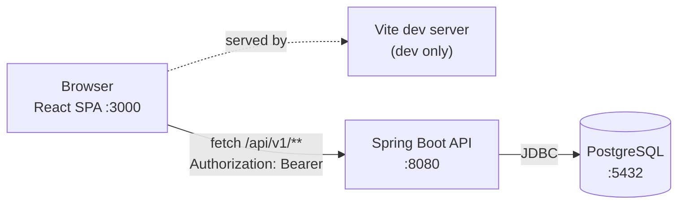
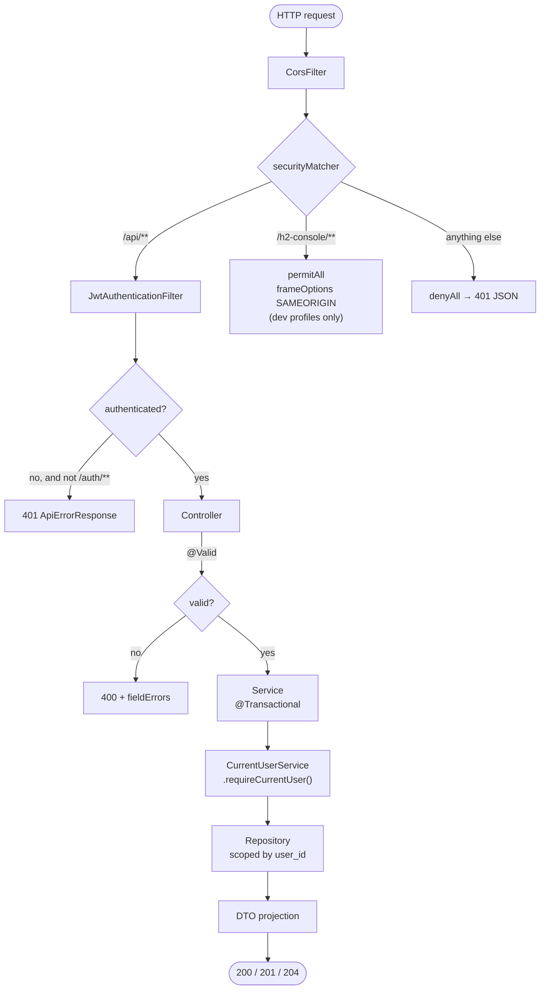
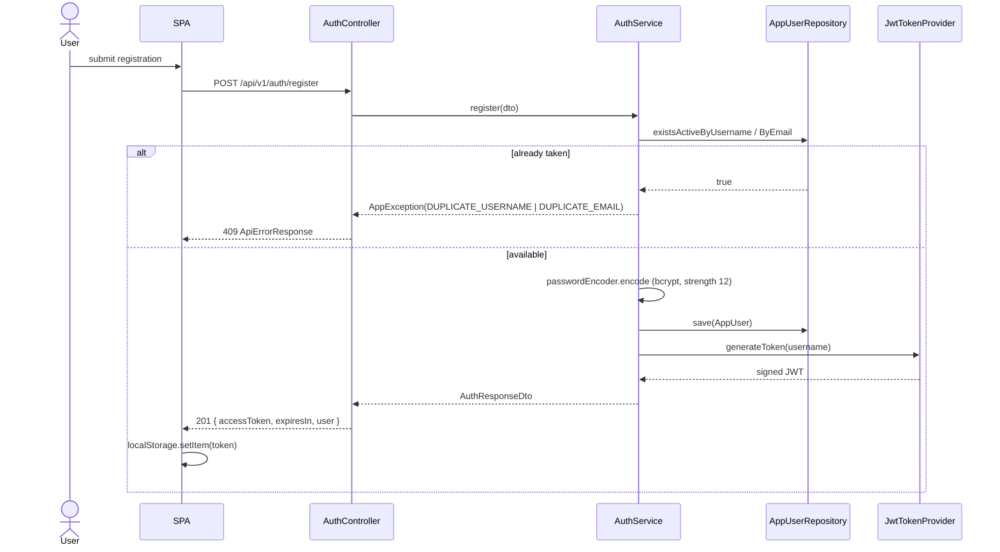
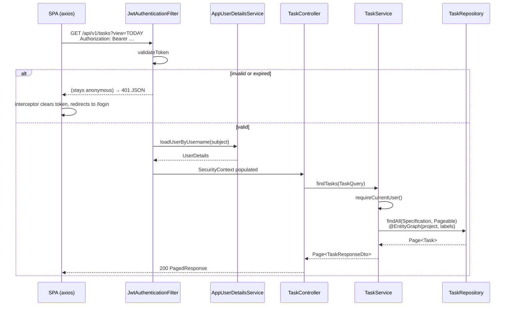
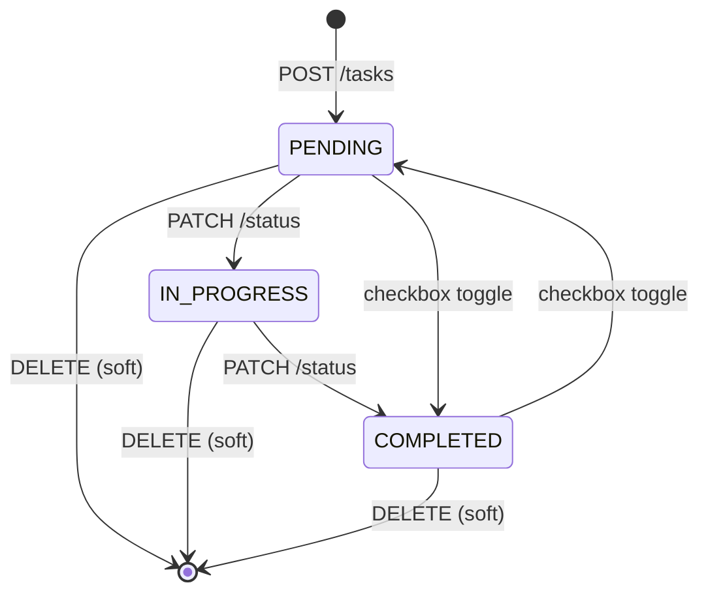
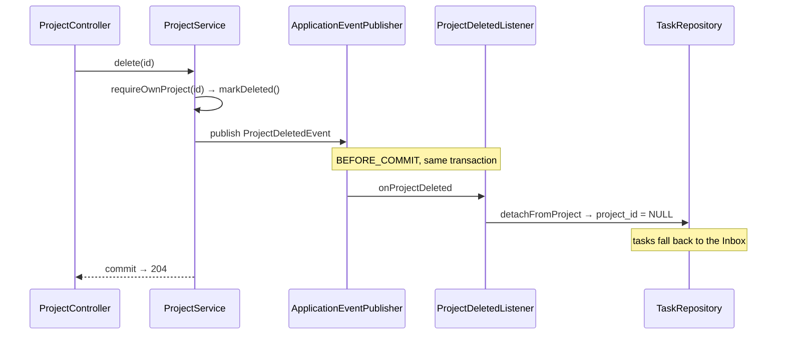
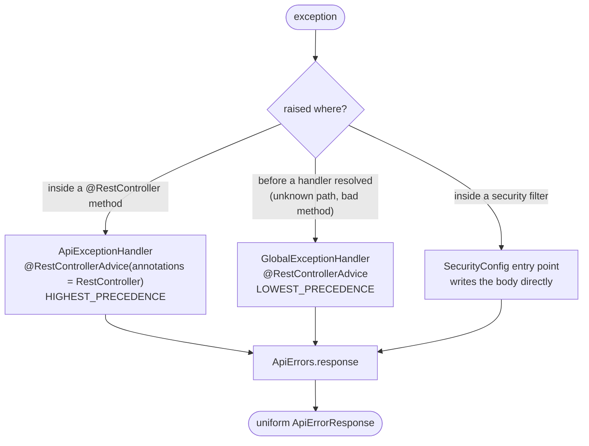
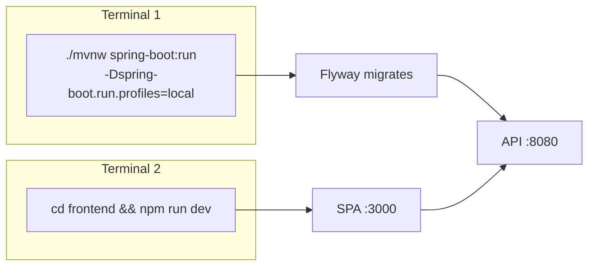

# FLOW — Request and Process Flows

How a request travels through the system, and the sequences behind each feature.

---

## 1. Deployment shape

The SPA and the API are separate origins, so every call is cross-origin and CORS is explicit.
There is no server-rendered UI: the backend answers JSON only.

---

## 2. Request pipeline

Three security chains exist so that a relaxation one surface needs cannot weaken another:

| Order | Matcher | Session | CSRF | Framing |
|--|--|--|--|--|
| 1 | `/api/**` | `STATELESS` | disabled — bearer only, no ambient cookie to ride on | `DENY` |
| 2 | `/h2-console/**` | default | disabled | `SAMEORIGIN` — console renders in frames |
| 3 | everything else | `STATELESS` | disabled | `DENY` |

Chain 2 is registered only when `spring.h2.console.enabled=true`, which no deployed profile sets.

---

## 3. Registration and sign-in

Sign-in is the same shape with `authenticationManager.authenticate`. A wrong name and a wrong
password both return the single `INVALID_CREDENTIALS` code, so the endpoint does not reveal
which accounts exist. `LoginAttemptService` locks an identifier after 5 failures for 15 minutes.

---

## 4. Authenticated call

The owning account always comes from the security context, never from a request parameter. A
task belonging to someone else returns **404, not 403** — a 403 would confirm the row exists.

---

## 5. Task lifecycle

`DELETE` sets `deleted = true`. The row stays for audit; every finder filters it out.

---

## 6. Project deletion

The listener lives in the **task** module and runs `BEFORE_COMMIT`, so the detach and the
soft-delete succeed or fail together. The project module never imports the task module.

---

## 7. Error flow

An annotation-scoped advice can only match when a handler method was resolved, so failures
raised earlier need the unscoped advice. All three paths build the body through `ApiErrors`, so
the shape never diverges.

| Situation | Status | Code |
|--|--|--|
| Bean validation failed | 400 | `E0400` + `fieldErrors` |
| Unparseable body, bad enum or bad number in a parameter | 400 | `E0400` |
| No token, expired token, forged token | 401 | `E0401` |
| Wrong credentials | 401 | `E0402` |
| Authenticated but not permitted | 403 | `E0403` |
| Absent, or owned by someone else | 404 | `E0404` |
| Unknown `/api` path | 404 | `E0404` |
| Wrong HTTP method | 405 | `E0405` |
| Duplicate username / email / project / label | 409 | `E0409`–`E0411` |
| Unsupported `Content-Type` | 415 | `E0415` |
| Anything else | 500 | `E0500`, detail logged only |

---

## 8. Local startup

`JWT_SECRET` is read from the environment. When unset, a random key is generated per process and
a warning is logged — fine for development, but tokens stop verifying after a restart.
