# TESTING — Manual and Automated

How to verify the application: what each feature does, how to exercise it by hand, and the
automated suites that cover the same ground.

| Suite | Count | Command | Needs |
|--|--|--|--|
| Backend unit + slice | 32 | `./mvnw test` | nothing |
| End-to-end (Playwright) | 22 | `cd frontend && npm run test:e2e` | API on `:8080`, SPA on `:3000` |
| Screenshots | 1 | `cd frontend && npm run screenshots` | both servers |

---

## 1. Getting a running system

Two terminals.

```bash
# Terminal 1 — API on :8080
createdb todolist                       # first time only
DB_USERNAME=$USER DB_PASSWORD= ./mvnw spring-boot:run -Dspring-boot.run.profiles=local
```

```bash
# Terminal 2 — SPA on :3000
cd frontend && npm install && npm run dev -- --port 3000 --strictPort
```

Open <http://localhost:3000>. Flyway migrates on first start; the schema arrives empty, so
register an account to begin.

> **Tokens and restarts.** With `JWT_SECRET` unset the signing key is random per process, so
> every backend restart invalidates issued tokens and the SPA bounces you to `/login`. Export a
> stable key to avoid that: `export JWT_SECRET=$(openssl rand -base64 48)`.

To test without PostgreSQL, use `SPRING_PROFILES_ACTIVE=h2` — in-memory, Flyway off, H2 console
at <http://localhost:8080/h2-console>.

---

## 2. Features, and how to test each by hand

### 2.1 Registration

Create an account. The username must be 3–50 characters of `A–Z a–z 0–9 . _ -`, the email must
parse, and the password must be at least 8 characters. Success stores a JWT and lands on the
dashboard.

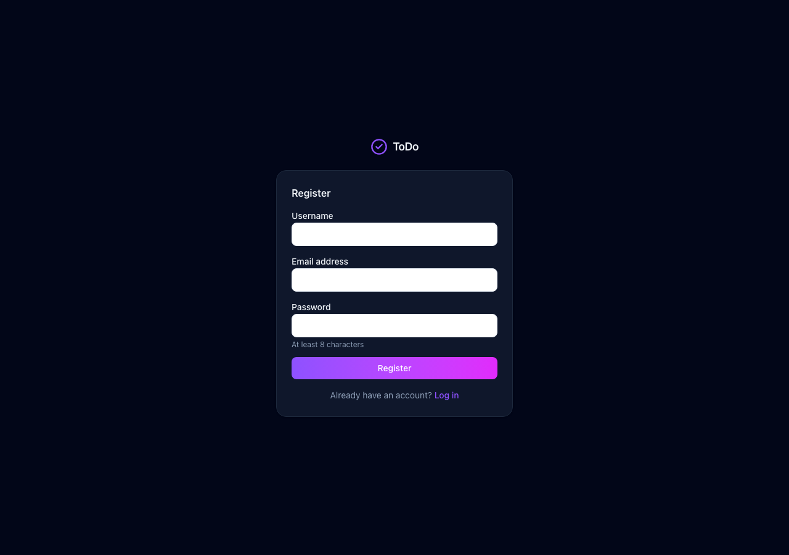

| Step | Expected |
|--|--|
| Submit valid details | Lands on `/`, greeting shows your name |
| Reuse a username | Stays on the form, toast: `このユーザー名は既に使用されています。` |
| Reuse an email | Toast: `このメールアドレスは既に使用されています。` |
| Password of 7 characters | Browser blocks submission (`minLength`) |

### 2.2 Sign-in and session

Accepts **either** the username or the email. A wrong name and a wrong password give the same
message, so the form never reveals which accounts exist.

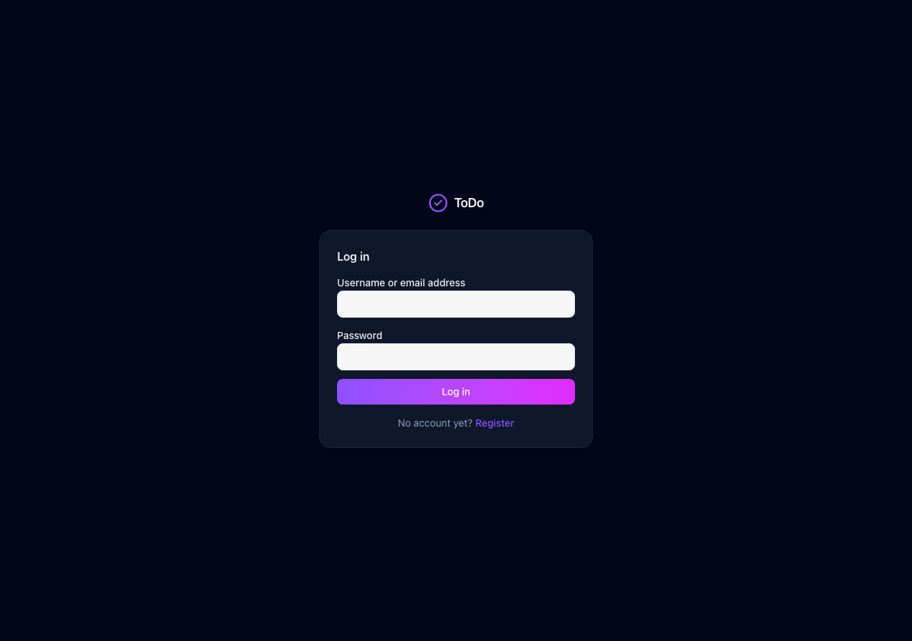

| Step | Expected |
|--|--|
| Correct credentials | Dashboard |
| Wrong password | Stays on `/login`, toast: `ユーザー名またはパスワードが正しくありません。` |
| Reload the dashboard | Still signed in — the token is restored through `GET /auth/me` |
| Log out, then visit `/` | Redirected to `/login` |
| Five wrong passwords in a row | Account locked for 15 minutes |
| Edit the token in devtools, reload | Redirected to `/login` |

### 2.3 Empty state

A fresh account has nothing. The list explains what to do rather than showing a blank area.

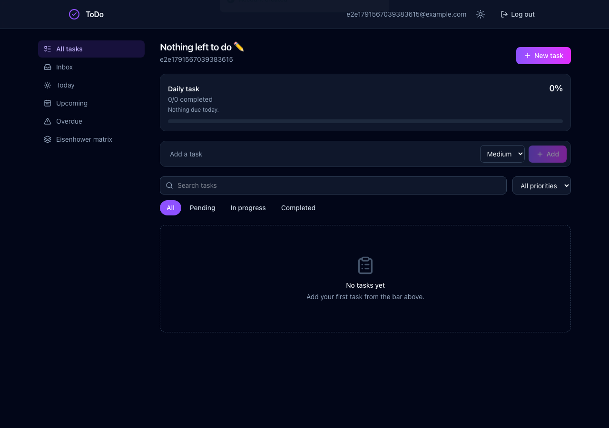

### 2.4 The dashboard

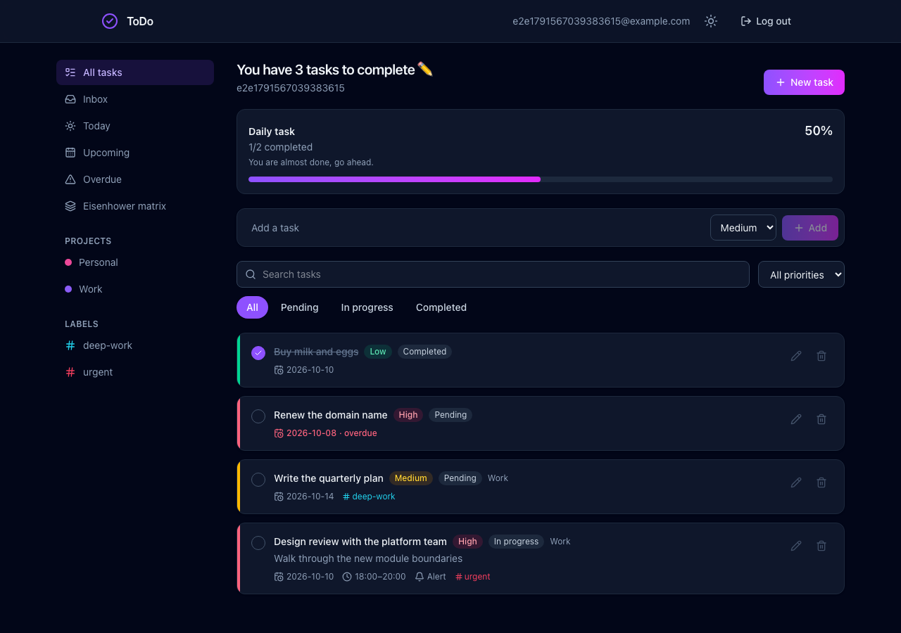

| Region | What it does |
|--|--|
| Greeting | Counts the tasks still open in the current view |
| Daily task card | Completed / total **due today**, with a percentage and progress bar |
| Quick add | Title plus a priority, creates immediately in the Inbox |
| Search | Case-insensitive title match, debounced 300 ms |
| Status tabs | All / Pending / In progress / Completed |
| Priority select | All / High / Medium / Low |
| Sidebar | Built-in views, then your projects and labels |
| Task card | Coloured priority bar, circular checkbox, badges, due date, time box, alert bell, labels |

### 2.5 Creating and editing

Quick add covers the common case. The modal covers everything: description, status, priority,
due date, start and end time, project, labels, and the urgent / important / alert switches.

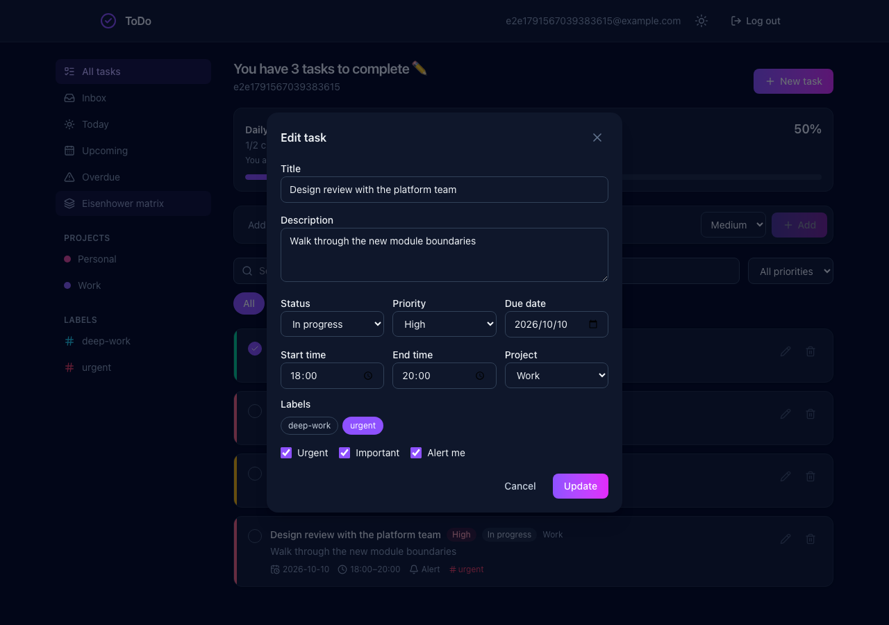

| Step | Expected |
|--|--|
| Quick add a title | Appears at the top of the list, toast `Task added` |
| Edit, change priority to High | Badge turns rose, left bar turns rose |
| Set 09:00–11:00 | Card shows `09:00–11:00` with a clock icon |
| Set end time **before** start | Rejected: `終了時刻は開始時刻より後にしてください` |
| Tick "Alert me" | Card shows a bell |
| Assign a project | Project name appears on the card; the task leaves the Inbox |
| Attach labels | Coloured `#label` chips appear on the card |

### 2.6 Completing and deleting

| Step | Expected |
|--|--|
| Click the circular checkbox | Fills violet, title strikes through, status becomes Completed, progress updates |
| Click it again | Returns to Pending |
| Click the bin | Confirmation dialog first — nothing is deleted on a mis-click |
| Confirm | Row disappears, toast `Task deleted` |

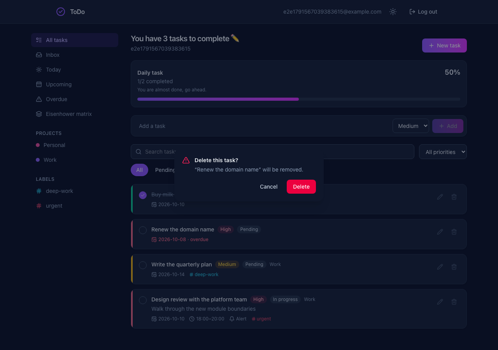

The checkbox and the delete are **optimistic**: the UI changes at once and rolls back with an
error toast if the call fails. Deletion is soft — the row stays in the database with
`deleted = true`.

### 2.7 Views

Derived from task attributes, so they cannot be renamed or deleted.

| View | Shows |
|--|--|
| All tasks | Everything active |
| Inbox | Tasks with no project |
| Today | Due today |
| Upcoming | Due within the next 7 days |
| Overdue | Past due and not completed |

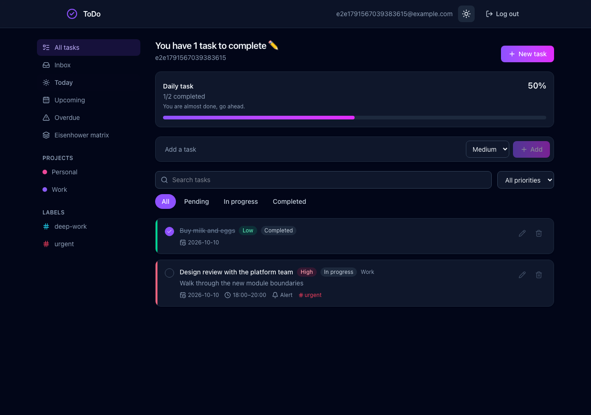


An overdue due date renders in rose with `· overdue` appended.

> **"Today" is the server's today.** The backend resolves it from a system-default-zone `Clock`.
> If the browser and the server are in different zones, a task can look due today in one and not
> the other. Worth deciding deliberately before this ships to users in multiple regions.

### 2.8 Eisenhower matrix

Urgent and Important are two independent switches on the task; the quadrant is derived, so it
can never disagree with them.

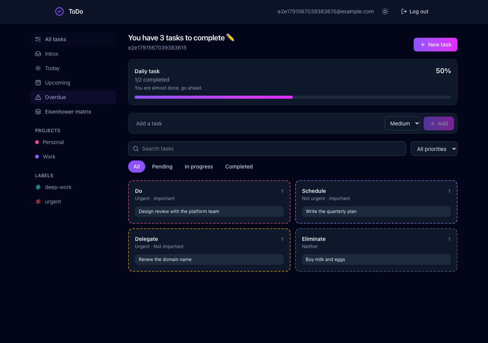

| Urgent | Important | Quadrant |
|--|--|--|
| ✓ | ✓ | Do |
| — | ✓ | Schedule |
| ✓ | — | Delegate |
| — | — | Eliminate |

### 2.9 Projects and labels

A project groups tasks; a task has at most one. Labels are many-to-many. Both are per-account
and their names are unique per account, case-insensitively.

**Deleting a project does not delete its tasks** — they fall back to the Inbox. Verify it:
create a project, put a task in it, delete the project, then open Inbox. The task is there with
its labels intact.

### 2.10 Search and filtering

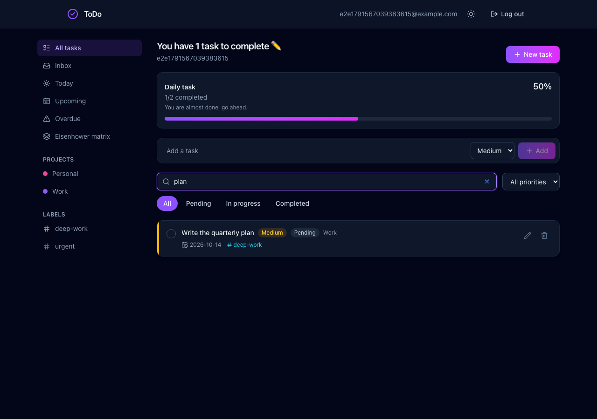

Filters compose: view **and** status **and** priority **and** search are all applied together.

### 2.11 Theme

Dark is the default, matching the reference design. The toggle persists per browser.

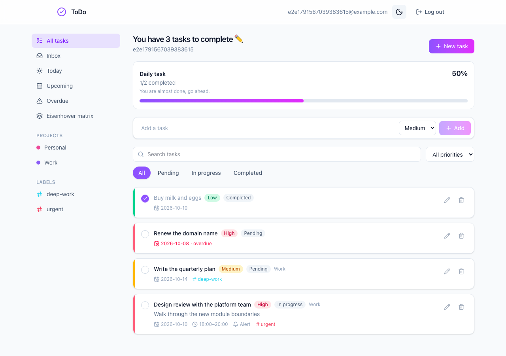

### 2.12 Responsive layout

The sidebar stacks above the list below the `lg` breakpoint.

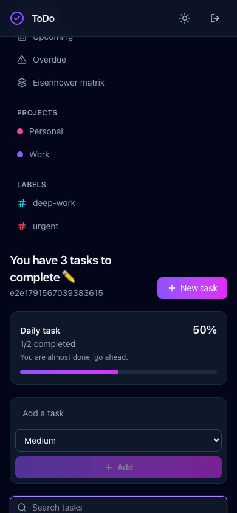

### 2.13 Input validation

Titles and descriptions accept letters, digits, spaces, punctuation and currency or maths
symbols — Japanese included — and reject `<`, `>` and control characters.

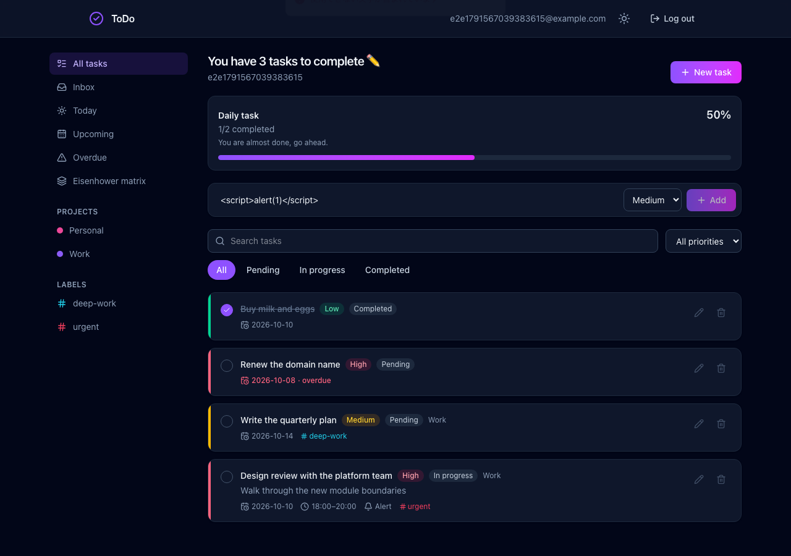

| Input | Expected |
|--|--|
| `<script>alert(1)</script>` | 400, `使用できない文字が含まれています` |
| `請求書を作成する` | Accepted |
| `Buy milk + eggs`, `¥1,000`, `50% done` | Accepted |
| Empty title | Add button stays disabled |
| 201 characters | Rejected by `maxLength` |

---

## 3. Test scenarios

Numbered so a result can be reported against one. Each has an automated counterpart unless
marked **manual only**.

### S1 — Happy path, new user to first completed task
1. Register a new account → dashboard, empty state
2. Quick add "Write the report" → appears, progress unchanged (no due date)
3. Edit it, set today's due date and High priority → card shows both; progress shows `0/1`
4. Tick the checkbox → strikethrough, `1/1`, 100%
5. Delete it, confirm → empty state again

*Covered by* `tasks.spec.ts`, `views.spec.ts`

### S2 — Data isolation between accounts
1. As Alice, create a task; note its id from the card's `data-task-id`
2. Log out, register Bob
3. Bob's list is empty
4. `GET`, `PATCH` and `DELETE` on Alice's task id as Bob

**Expected: 404 on all three, not 403.** A 403 would confirm the row exists.

*Covered by* `isolation.spec.ts`

### S3 — Session lifecycle
1. Register → reload → still signed in
2. Corrupt the token in `localStorage` → reload → back to `/login`
3. Log out → `/` redirects to `/login`

*Covered by* `auth.spec.ts`

### S4 — Views and the matrix
1. Seed four tasks: due today / overdue / due in 3 days / no due date
2. Check Today = 1, Overdue = 1, Upcoming = 2, Inbox = 4
3. Open the matrix and confirm placement by the two switches

*Covered by* `views.spec.ts`

### S5 — Validation boundaries
1. Markup in a title → rejected
2. End time before start time → rejected
3. Duplicate username and email on register → 409 with distinct messages

*Covered by* `auth.spec.ts`, `tasks.spec.ts`

### S6 — Project deletion keeps the work — **manual only**
1. Create project "Work", assign a task to it
2. Delete the project
3. Open Inbox

Expected: the task is in the Inbox, labels intact; the project is gone from the sidebar.

### S7 — API error contract — **manual only**

```bash
TOKEN=...   # from the login response
API=http://localhost:8080/api/v1
curl -s -o /dev/null -w '%{http_code}\n' "$API/tasks"                              # 401
curl -s -o /dev/null -w '%{http_code}\n' "$API/tasks?status=BOGUS" -H "Authorization: Bearer $TOKEN"  # 400
curl -s -o /dev/null -w '%{http_code}\n' "$API/tasks/nope/x"      -H "Authorization: Bearer $TOKEN"  # 404
curl -s -o /dev/null -w '%{http_code}\n' -X PUT "$API/tasks"      -H "Authorization: Bearer $TOKEN"  # 405
curl -s -o /dev/null -w '%{http_code}\n' -X POST "$API/tasks" -H "Content-Type: text/plain" \
  -d x -H "Authorization: Bearer $TOKEN"                                           # 415
```

Every response body must be an `ApiErrorResponse` — JSON, never HTML.

### S8 — CORS — **manual only**

```bash
curl -s -D - -o /dev/null -X OPTIONS http://localhost:8080/api/v1/tasks \
  -H "Origin: http://localhost:3000" -H "Access-Control-Request-Method: GET"   # 200 + allow headers
curl -s -o /dev/null -w '%{http_code}\n' -X OPTIONS http://localhost:8080/api/v1/tasks \
  -H "Origin: http://evil.com" -H "Access-Control-Request-Method: GET"         # 403
```

---

## 4. Automated tests

### 4.1 Backend — `./mvnw test`

| Class | Kind | Covers |
|--|--|--|
| `EisenhowerQuadrantTest` | unit | The full urgent × important truth table |
| `DailyProgressDtoTest` | unit | Percentage rounding, zero-task day without dividing by zero |
| `PreconditionsTest` | unit | Guards raise `AppException`, never a JDK runtime exception |
| `LoginAttemptServiceTest` | unit | Lockout threshold and reset |
| `TaskServiceTest` | unit, Mockito | Sort allowlist, page-size clamping, owner scoping, soft delete, clock-driven progress |
| `TaskControllerTest` | slice, `@WebMvcTest` | 401 JSON, validation shape, allowlist rejection, 404 for foreign tasks, status codes, security headers |

No test needs a database. `TaskServiceTest` injects a fixed `Clock`, so the date-dependent views
do not drift with the calendar.

Two Boot 4 details the slice test depends on, both easy to trip over:

- `@WebMvcTest` no longer auto-configures Spring Security, so the four security
  auto-configurations are imported explicitly.
- The API chain is `STATELESS`, which discards the context `@WithMockUser` installs. The tests
  authenticate through the real `JwtAuthenticationFilter` with a stubbed token provider instead —
  which also exercises the filter.

### 4.2 End-to-end — `cd frontend && npm run test:e2e`

Playwright against the real SPA and the real API. Each spec registers a uniquely named account,
so runs are repeatable and do not collide.

| Spec | Tests | Covers |
|--|--|--|
| `auth.spec.ts` | 6 | Guard redirect, registration, duplicate rejection, bad credentials, session persistence, tampered token |
| `tasks.spec.ts` | 9 | Empty state, quick add, toggle, full edit, time-range rejection, allowlist rejection, delete with confirmation, search, status tabs |
| `views.spec.ts` | 6 | Today, Overdue, Upcoming, Inbox, matrix placement, progress |
| `isolation.spec.ts` | 1 | Cross-account 404 on read, update and delete |

```bash
npm run test:e2e          # headless
npm run test:e2e:ui       # interactive runner
npm run test:e2e:report   # last HTML report
```

Traces are retained on failure: `npx playwright show-trace test-results/<dir>/trace.zip`.

### 4.3 Screenshots — `npm run screenshots`

Regenerates everything under `docs/screenshots/`. Run it after a UI change so the documentation
does not drift from the product.

---

## 5. Not covered

Be explicit about the gaps rather than implying coverage that does not exist.

| Gap | Why |
|--|--|
| Repository queries against real PostgreSQL | No `@DataJpaTest`; the specifications and partial indexes are exercised only through the running app |
| `ProjectDeletedListener` | Verified by hand (S6), not automated — it needs a transactional integration test |
| Project and label CRUD in the UI | The API is covered; the SPA has no create/edit form for them yet, only the sidebar |
| Concurrency | No test for two clients editing the same task |
| Load and performance | None |
| Accessibility | Roles and labels are set, but no axe or screen-reader pass |
| Reminder delivery | `alertEnabled` is stored; nothing sends a notification |
